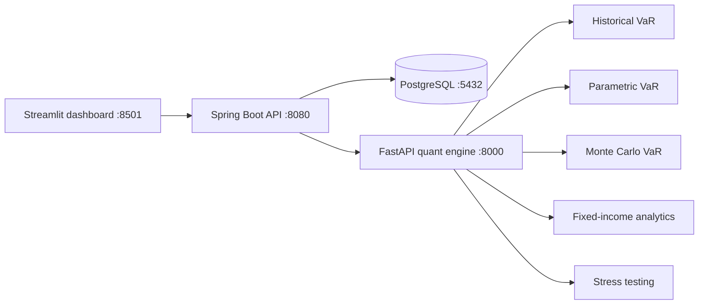

# Portfolio Risk Platform

A local, multi-service portfolio risk application. The Spring Boot backend owns portfolio and market-data APIs, coordinates risk calculations, and persists results. A separate FastAPI service performs quantitative calculations. A Streamlit dashboard presents portfolio data and invokes the backend APIs.

## Architecture



### Components

- **Backend (`backend/`)**: Java 21 and Spring Boot 3.3.4 REST API. It manages portfolios, positions, market prices, risk limits, and saved calculation results. Spring Data JPA provides persistence; Flyway owns schema evolution. Hibernate validates the schema rather than creating it automatically.
- **Quant engine (`quant-engine/`)**: Python 3.12, FastAPI, Pydantic, NumPy, pandas, and SciPy. Calculation code is separated into focused modules under `risk/`; `main.py` exposes the HTTP API.
- **Dashboard (`frontend_streamlit/`)**: Streamlit UI that calls the backend over HTTP. It compares VaR methods, displays risk contributions, runs stress scenarios, and evaluates configured risk limits.
- **Database (`docker-compose.yml`)**: PostgreSQL 16 for local development. Flyway migrations create portfolio, position, market-price, risk-calculation, and risk-limit tables.

### Design Decisions

- The backend is the system-of-record and orchestration layer; the Python service is stateless calculation infrastructure.
- Quantitative calculations are kept outside the Java domain services so the Python numerical stack can evolve independently of REST and persistence concerns.
- Portfolio risk calculation input is read in a short read-only transaction. The HTTP call to the quant engine happens outside that transaction, and the result is persisted in a separate write transaction. This avoids holding database resources while waiting on network I/O.
- The Java quant-engine client uses Spring `RestClient` with a shared JDK HTTP/1.1 client. Explicit timeouts and a single HTTP configuration are used for the downstream calls.
- JSON uses camelCase at the service boundary. FastAPI's Pydantic models translate this to Python's snake_case fields.
- Flyway migrations are the source of truth for database schema changes; `ddl-auto: validate` catches schema/entity mismatches at startup.

## Features

- Portfolio and position CRUD
- CSV market-price upload and historical price queries
- Historical, parametric, and Monte Carlo VaR and expected shortfall
- Per-instrument risk contribution
- Scenario stress testing
- Risk-limit creation, listing, deletion, and evaluation
- Fixed-income bond price, Macaulay/modified duration, convexity, DV01, and rate-shock analysis

## Prerequisites

- Java 21
- Maven 3.9 or later
- Python 3.12 (the commands below use the interpreter path shown in the development environment; replace it if Python is installed elsewhere)
- Docker Desktop with Docker Compose

Ports used by the default local configuration: PostgreSQL `5432`, quant engine `8000`, backend `8080`, Streamlit `8501`.

## Run Locally (Windows PowerShell)

Run each long-lived service in its own terminal, from the repository root `D:\portfolioRiskPlatform\portfolio-risk-platform`.

### 1. Start PostgreSQL

```powershell
docker compose up -d postgres
```

The local database defaults in `backend/src/main/resources/application.yml` are `riskplatform` / `risk_user` / `risk_pass`. These are development credentials; use environment-based secrets for shared or production deployments.

### 2. Start the quant engine

```powershell
cd .\quant-engine
C:\Python312\python.exe -m pip install -r .\requirements.txt
C:\Python312\python.exe -m uvicorn main:app --reload --port 8000
```

Health check:

```powershell
Invoke-RestMethod http://localhost:8000/health
```

### 3. Start the backend

In another terminal:

```powershell
cd D:\portfolioRiskPlatform\portfolio-risk-platform\backend
mvn spring-boot:run
```

On startup, Flyway applies pending migrations and Hibernate validates the mapped schema. The backend expects the quant engine at `http://localhost:8000`; change `quant-engine.base-url` in `application.yml` or use an externalized configuration when running elsewhere.

### 4. Start the Streamlit dashboard

In another terminal:

```powershell
cd D:\portfolioRiskPlatform\portfolio-risk-platform\frontend_streamlit
C:\Python312\python.exe -m streamlit run dashboard.py
```

Open the URL printed by Streamlit, normally `http://localhost:8501`. The dashboard expects the Spring backend at `http://localhost:8080`.

The repository's shared Python dependency file is `quant-engine/requirements.txt`; it includes the quant engine and dashboard dependencies. `python -m ...` is used so commands work even when Python's `Scripts` directory is not on `PATH`.

## API Overview

Base URL: `http://localhost:8080`

| Method | Path | Purpose |
|---|---|---|
| `GET` | `/api/portfolios` | List portfolios |
| `POST` | `/api/portfolios` | Create a portfolio |
| `GET` | `/api/portfolios/{id}` | Get a portfolio |
| `POST` | `/api/portfolios/{id}/positions` | Add a position |
| `GET` | `/api/portfolios/{id}/positions` | List positions |
| `POST` | `/api/market-data/upload` | Upload market-price CSV (`multipart/form-data`, field `file`) |
| `GET` | `/api/market-data/{instrumentId}/history` | Read price history; optional `from` and `to` date parameters |
| `POST` | `/api/portfolios/{id}/risk-calculations/historical-var` | Historical VaR |
| `POST` | `/api/portfolios/{id}/risk-calculations/parametric-var` | Parametric VaR |
| `POST` | `/api/portfolios/{id}/risk-calculations/monte-carlo-var` | Monte Carlo VaR |
| `POST` | `/api/portfolios/{id}/risk-calculations/risk-contribution` | Per-instrument contribution to portfolio VaR |
| `POST` | `/api/portfolios/{id}/risk-calculations/stress-test` | Run a portfolio scenario |
| `GET` | `/api/risk-calculations/{id}` | Read a saved calculation |
| `POST` | `/api/portfolios/{id}/risk-limits` | Create a risk limit |
| `GET` | `/api/portfolios/{id}/risk-limits` | List risk limits |
| `GET` | `/api/portfolios/{id}/risk-limits/evaluate` | Evaluate current limits |
| `POST` | `/api/fixed-income/analyze` | Bond analytics |
| `POST` | `/api/fixed-income/rate-shock` | Fixed-income rate-shock analysis |

VaR endpoints accept `confidenceLevel` (default `0.95`) and `horizonDays` (default `1`) as query parameters. Monte Carlo additionally accepts `numSimulations` (default `10000`) and `randomSeed` (default `42`). Stress testing accepts `scenarioName`, `equityShockPct`, `rateShockBps`, and `fxShockPct` as query parameters.

Example PowerShell request:

```powershell
curl.exe -X POST "http://localhost:8080/api/portfolios/3/risk-calculations/parametric-var?confidenceLevel=0.95&horizonDays=1"
```

For JSON POST bodies from PowerShell, use `curl.exe --globoff` and `--data-raw` with a single-quoted JSON string, or use `Invoke-RestMethod` with `ConvertTo-Json`.

## Tests

Backend tests:

```powershell
cd D:\portfolioRiskPlatform\portfolio-risk-platform\backend
mvn test
```

Quant-engine tests:

```powershell
cd D:\portfolioRiskPlatform\portfolio-risk-platform\quant-engine
C:\Python312\python.exe -m pytest -v
```

## Configuration Notes

- Backend configuration: `backend/src/main/resources/application.yml`
- Python dependencies: `quant-engine/requirements.txt`
- Database schema: `backend/src/main/resources/db/migration/`
- The sample market data and sample position CSVs are under `backend/src/main/resources/data/`.
- Localhost URLs and credentials are development defaults, not production deployment settings.

## Known Limitations

This is a learning/demonstration project, not a production risk system. Specific simplifications, documented rather than hidden:

- **Parametric and Monte Carlo VaR assume normally distributed returns.** Both will understate tail risk for fat-tailed, skewed real-world returns — Historical VaR is included specifically to show this gap, not as a redundant third method.
- **Bond positions carry no coupon/maturity metadata.** Stress testing applies rate shocks via a configurable duration/convexity approximation rather than full per-bond repricing; the standalone `/api/fixed-income` endpoints do support exact bond-level analytics when given full bond parameters.
- **Market data is a fixed, synthetically generated 252-day window**, not a live feed. All reproducibility claims (identical inputs → identical outputs, given a fixed random seed) are verified by the test suite — this is the property that matters for a demo dataset.
- **Audit trail covers single-result calculations** (VaR/ES) via the `risk_calculation` table; risk contribution and stress test results are not yet persisted with the same audit metadata.
- **No authentication/authorization.** Out of scope for a local demo project.

## Testing Philosophy

Quant correctness and API wiring are tested separately, deliberately:

- **Quant engine (pytest, 29 tests)**: VaR, Expected Shortfall, bond pricing, duration/convexity, and risk-contribution formulas are asserted against values computed *independently* of the implementation under test (by hand, or via a separate closed-form calculation in the test itself) — not by re-deriving the expected value from the same code being tested. Monte Carlo is tested for the properties that must hold under randomness (same-seed reproducibility, convergence toward the parametric closed-form at high simulation counts) rather than exact values.
- **Backend (JUnit, 8+ tests)**: Pure business logic (risk-limit status classification) is tested without a Spring context for speed; `QuantEngineClient` is tested against `MockRestServiceServer` to verify both the exact outgoing request shape and correct error-wrapping on downstream failures — the same class of bug (a silently malformed request) that caused a real HTTP/1.1 compatibility issue during development (see `design-decisions.md`).